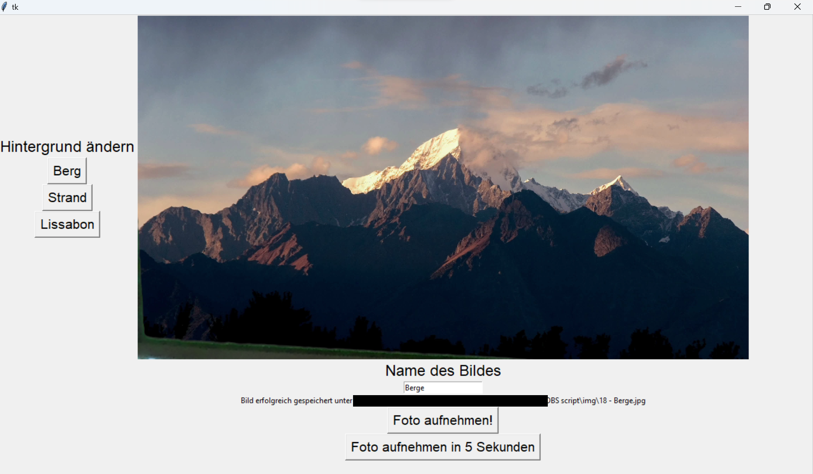

# Greenscreen Foto App

Frontend um Fotos aufzunehmen und Hintergrund ändern mittels OBS.

## Setup

1. OBS herunterladen: https://obsproject.com/download.
1. OBS starten.
1. Alle gewünschten Hintergründe als Source hinzufügen und sinnvoll benennen, da die Namen der Hintergründe später genauso in der App stehen werden.
1. Die Kamera als Source hinzufügen und in den Vordergrund bringen.
1. Greenscreen-Filter für die Kamera hinzufügen. Er ist unter "Effect Filters" und er heißt "Chroma Key". Die Einstellungen können beliebig angepasst werden.
1. "Start Virtual Camera" drücken.
1. Im File `picturesScript.py` die Settings updaten. Die Namen der Kamera und 
der Backgrounds müssen die gleichen sein, wie die Namen der "Sources" in OBS.
Die `cameraID` ist die ID der Virtual Camera von OBS. Man kann die richtige ID durch Ausprobieren finden, wahrscheinlich ist es eine Zahl zwischen 0 und 5.
1. Script starten.

## Features

1. Man kann einen von mehreren Hintergründen aussuchen.
1. Man kann Fotos machen, die automatisch in aufsteigender Reihenfolge nummeriert werden und im Verzeichnis `img/` gespeichert werden.
1. Man kann einen Countdown von 5 Sekunden starten um ein Foto zu machen.
1. Wenn man einen Namen eingibt für das Bild, dann wird die Datei so benannt (mit einer Zahl davor und `.jpg` am Ende).

### Beispiel

